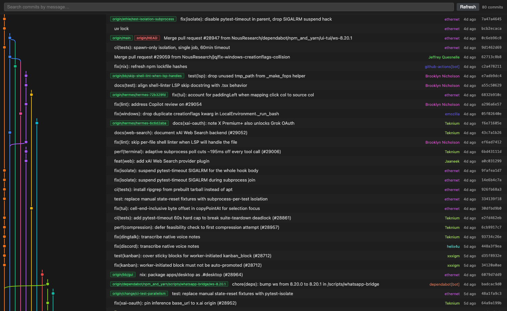
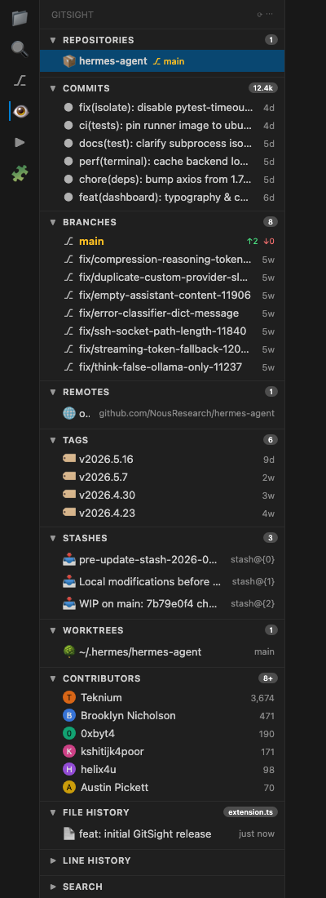
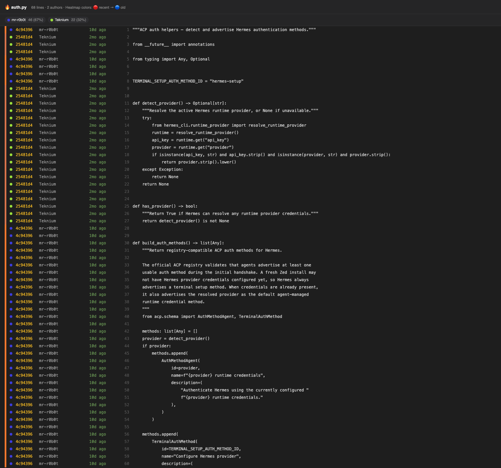
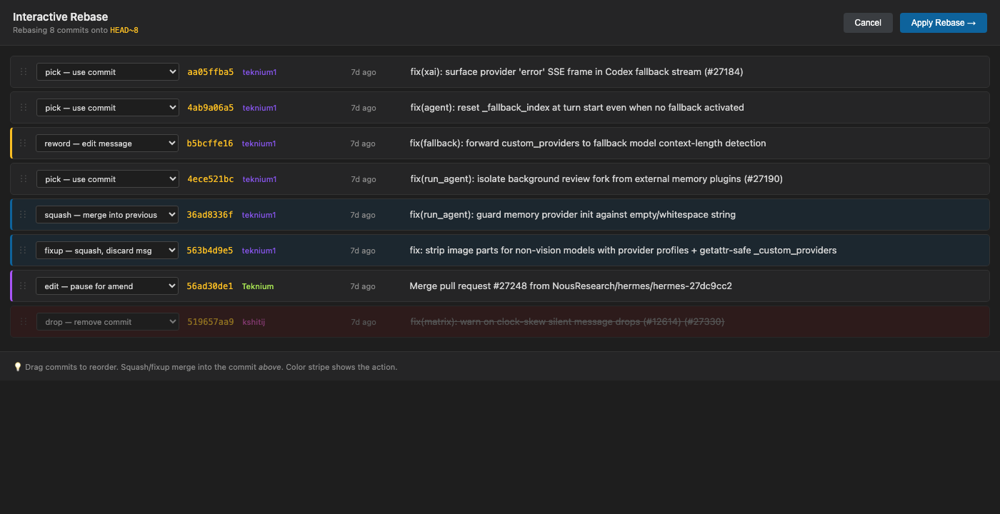
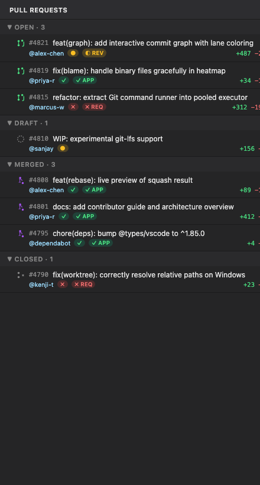

# GitSight

**Git visualization for VS Code, supercharged.** A free, open-source alternative to GitLens — with the headline Pro features built in.

> Commit Graph. Inline Blame. File & Line History. Worktrees. Branch & Tag Explorer. Compare. AI Commit Messages. All free.

## Screenshots

### Commit Graph
Multi-lane graph webview with branch/tag/HEAD ref pills, per-author colors, live search.



### Sidebar Views
12 tree views — Repositories, Commits, Branches, Remotes, Tags, Stashes, Worktrees, Contributors, File History, Line History, Search, **Pull Requests**.



### Blame Heatmap
Visualize file history at a glance: red = recent commits, blue = ancient. Author dots and per-line attribution.



### Interactive Rebase
Drag-to-reorder commits, set actions (pick/reword/squash/fixup/drop), edit messages inline. Applies via `git rebase -i` with no terminal needed.



### Pull Requests (GitHub + Azure DevOps)
Native PR sidebar grouped by Open / Draft / Merged / Closed. Status check & review badges. One-click checkout via `gh pr checkout`.




## Features

### 🔀 Commit Graph
Multi-lane interactive graph webview with all branches, refs (branches/tags/HEAD highlighted), authors, and dates. Live search, click any commit for the full diff, click any SHA to copy.

### 👤 Inline Blame
Current-line blame annotation showing author, age, and commit message. Fully configurable format.

### 🌡️ Heatmap & Author Gutter
- **Heatmap** — gutter dots colour-graded by commit age (hot = recent, cold = old).
- **Author gutter** — overview ruler stripe per author.

### 📜 File & Line History
- **File History** sidebar — every commit touching the active file (with rename tracking).
- **Line History** sidebar — every commit touching the current line (`git log -L`).

### 🌳 Worktrees (first-class)
Create, remove, switch. One-click "open in new window."

### 🌿 Branch & Tag Explorer
- Local + remote branches grouped, with ahead/behind tracking.
- Checkout / rename / delete / merge / rebase / compare from the context menu.
- Tags sidebar with annotated tooltips, create/delete.

### ☁️ Remotes
List, add, remove. One-click open commits on GitHub/GitLab/Bitbucket.

### 📦 Stashes
List with branch + age. Apply / Pop / Drop / Save.

### 👥 Contributors
Top-100 contributors sorted by commit count.

### 🔍 Search & Compare
- Search commit messages across all branches.
- Compare any two branches with a unified diff view.

### ✨ AI Commit Messages & Explanations
- **Generate commit message** from staged diff (Copilot via `vscode.lm`, no API keys)
- **Explain commit** — natural-language summary of any commit

### 🔥 Blame Heatmap (NEW)
Full-file blame visualizer. Heat strip on the left fades from red (recent) to blue (ancient). Author dots, sha, time-ago, and a legend showing per-author contribution percentages.

### 🌀 Interactive Rebase (NEW)
GUI replacement for `git rebase -i`. Drag commits to reorder. Pick action per commit from a dropdown. Edit subject inline. Click Apply — GitSight drives `git rebase -i` with a temp sequencer editor. No more `:wq` in a terminal.

### 📂 Historic File Filesystem (NEW)
Custom `gitsight://` virtual filesystem. Open any file at any commit as a real read-only VS Code editor tab — language services, peek-definition, and diff-against-working all work natively. Powers the file-history → "open at this commit" command.

### 🔄 Pull Requests — GitHub + Azure DevOps (NEW in 1.2)

Auto-detects the host from your `origin` remote and uses the right CLI:

- **GitHub** — needs `gh` (`brew install gh && gh auth login`)
- **Azure DevOps** — needs `az` with the devops extension (`brew install azure-cli && az extension add --name azure-devops && az login`). Supports both `dev.azure.com/{org}/{project}/_git/{repo}` and legacy `{org}.visualstudio.com`.

Same sidebar UI for both — grouped by Open/Draft/Merged(Completed)/Closed(Abandoned), with review and status-check badges, and a provider tag so you always know which host you're looking at. The PR detail webview renders body, files, and reviews (ADO reviewer votes → APPROVED / WAITING_FOR_AUTHOR / REJECTED).
Native PR sidebar (requires `gh` CLI). Grouped by Open / Draft / Merged / Closed. Status check + review decision badges. Tooltip shows full PR metadata, author, branch, diff size, labels. Click to open a rich PR webview with body, files changed, and reviews. Right-click → Checkout PR.

### ⚙️ Quick Branch Ops
Cherry-pick, revert, reset (soft/mixed/hard), checkout — right-click any commit.

### 📊 Status Bar
Current branch + ahead/behind indicator. Click to open the Commit Graph.

## Configuration

| Setting | Default | Description |
|---|---|---|
| `gitsight.blame.enabled` | `true` | Inline blame annotation |
| `gitsight.blame.format` | `${author}, ${ago} • ${message}` | Annotation template |
| `gitsight.blame.delay` | `200` | Delay before annotation appears (ms) |
| `gitsight.heatmap.enabled` | `false` | Gutter heatmap by commit age |
| `gitsight.heatmap.coldDays` | `365` | Days at which a line is fully "cold" |
| `gitsight.authors.enabled` | `false` | Per-line author colour in overview ruler |
| `gitsight.statusBar.enabled` | `true` | Status bar branch info |
| `gitsight.graph.maxCommits` | `1000` | Max commits in graph |
| `gitsight.graph.showAllBranches` | `true` | Include all branches in graph |
| `gitsight.ai.provider` | `copilot` | `copilot`, `ollama`, `none` |
| `gitsight.ai.model` | `gpt-4o-mini` | Model name (Ollama) |

## Develop

```bash
npm install
npm run compile
# F5 in VS Code → Extension Development Host
```

## Package & Install

```bash
npm run package         # outputs gitsight-1.0.0.vsix
code --install-extension gitsight-1.0.0.vsix
```

## Why?

GitLens is excellent, but its highest-value features — Commit Graph, Worktrees view, AI commits, search & compare — sit behind a Pro subscription. GitSight delivers those features, free and open, with a smaller install footprint and a clean modern UI.

## License

MIT. Contributions welcome.
