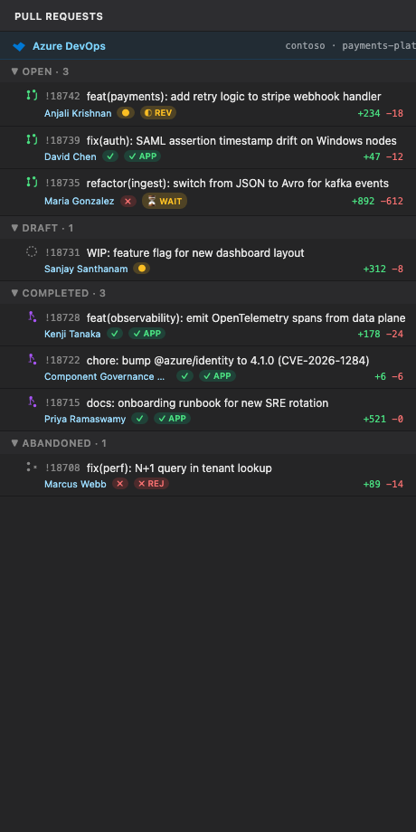
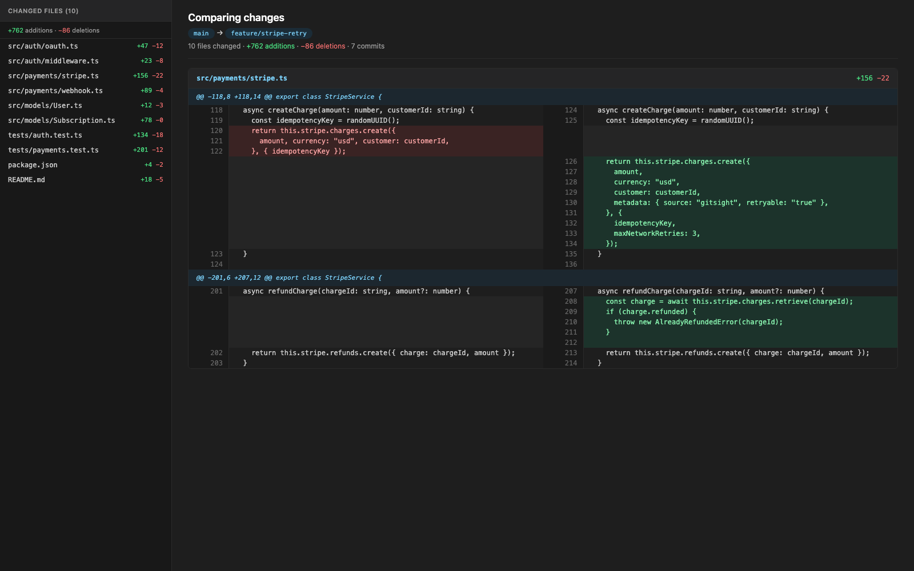
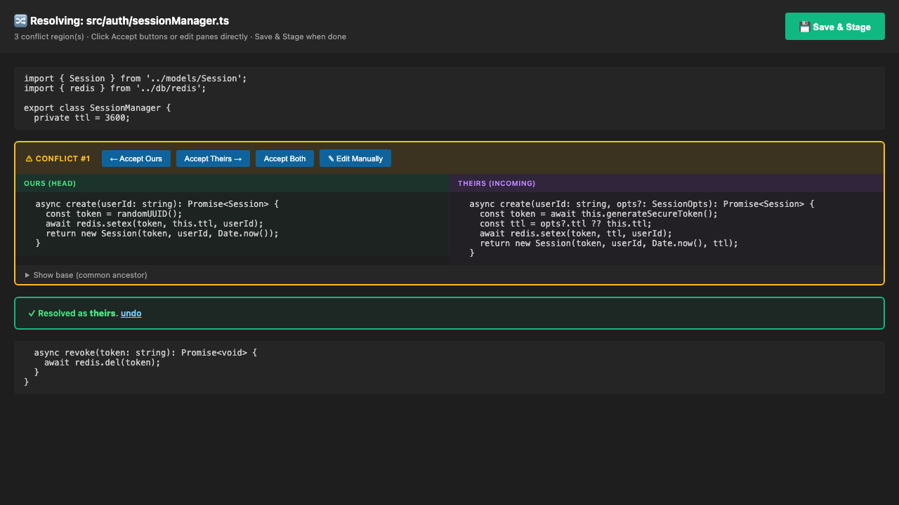
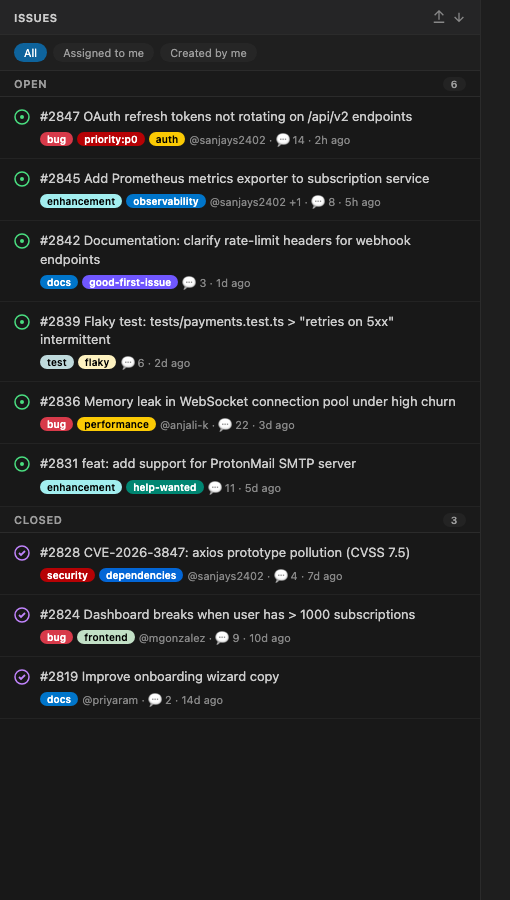
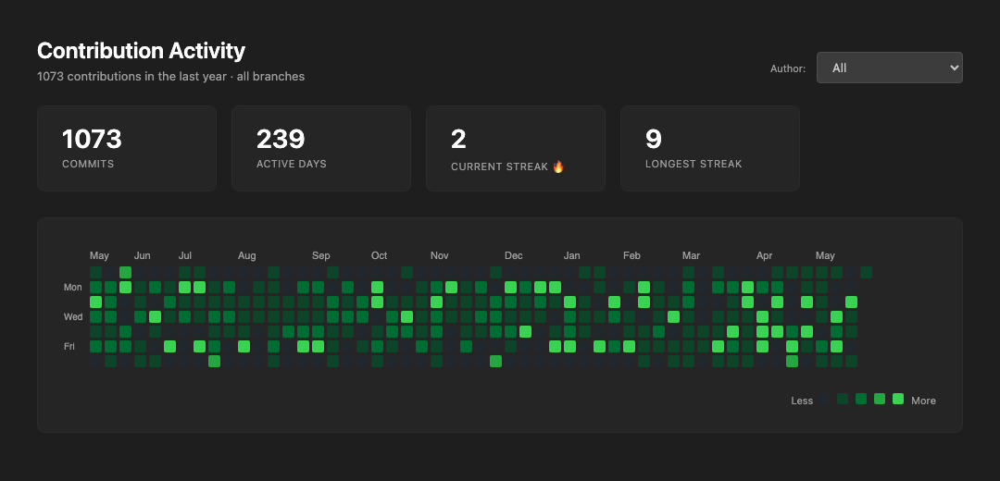

# GitSight

**Git visualization for VS Code, supercharged.** A free, open-source alternative to GitLens — with the headline Pro features built in.

> Commit Graph. Inline Blame. File & Line History. Worktrees. Branch & Tag Explorer. Compare. AI Commit Messages. All free.

## Screenshots

### Commit Graph
Multi-lane graph webview with branch/tag/HEAD ref pills, per-author colors, live search.


### Sidebar Views
12 tree views — Repositories, Commits, Branches, Remotes, Tags, Stashes, Worktrees, Contributors, File History, Line History, Search, **Pull Requests**.


### Blame Heatmap
Visualize file history at a glance: red = recent commits, blue = ancient. Author dots and per-line attribution.


### Interactive Rebase
Drag-to-reorder commits, set actions (pick/reword/squash/fixup/drop), edit messages inline. Applies via `git rebase -i` with no terminal needed.


### Pull Requests (GitHub + Azure DevOps)
Native PR sidebar grouped by Open / Draft / Merged / Closed. Status check & review badges. One-click checkout via `gh pr checkout`.

| GitHub | Azure DevOps |
|---|---|
|  |  |

Same sidebar, auto-detected from your `origin` remote. Provider badge at the top tells you which host you're looking at; group labels swap to ADO terminology ("Completed" / "Abandoned") when on Azure DevOps.

### Split-Diff Range Viewer
Compare any two refs (`main` ↔ `feature/x`, `v1.0` ↔ `HEAD`) in a GitHub-style side-by-side view. File tree sidebar with per-file `+/-` stats, chunk-level highlighting, jump-to-file. Command: **GitSight: Compare Refs (Split Diff)**.



### Merge Conflict 3-Pane Resolver
Drop the `<<<<<<<` markers. Visual conflict resolution with **Accept Ours / Accept Theirs / Accept Both / Edit** buttons per chunk. Optional base view. Click Save & Stage — done. Command: **GitSight: Resolve Merge Conflicts**.



### GitHub Issues Sidebar
Full Issues view alongside Pull Requests. Filter by **All / Assigned to Me / Created by Me**. Click any issue to open a rich webview with full markdown body, labels, and the entire comment thread. Backed by `gh` CLI — no token management.



### Contribution Activity Heatmap
GitHub-style year-long contribution grid with **current streak**, **longest streak**, total commits, and active days. Filter by author. 100% local — pure `git log`, no API calls. Command: **GitSight: Contribution Activity Heatmap**.




## Features

### 🔀 Commit Graph
Multi-lane interactive graph webview with all branches, refs (branches/tags/HEAD highlighted), authors, and dates. Live search, click any commit for the full diff, click any SHA to copy.

### 👤 Inline Blame
Current-line blame annotation showing author, age, and commit message. Fully configurable format.

### 🌡️ Heatmap & Author Gutter
- **Heatmap** — gutter dots colour-graded by commit age (hot = recent, cold = old).
- **Author gutter** — overview ruler stripe per author.

### 📜 File & Line History
- **File History** sidebar — every commit touching the active file (with rename tracking).
- **Line History** sidebar — every commit touching the current line (`git log -L`).

### 🌳 Worktrees (first-class)
Create, remove, switch. One-click "open in new window."

### 🌿 Branch & Tag Explorer
- Local + remote branches grouped, with ahead/behind tracking.
- Checkout / rename / delete / merge / rebase / compare from the context menu.
- Tags sidebar with annotated tooltips, create/delete.

### ☁️ Remotes
List, add, remove. One-click open commits on GitHub/GitLab/Bitbucket.

### 📦 Stashes
List with branch + age. Apply / Pop / Drop / Save.

### 👥 Contributors
Top-100 contributors sorted by commit count.

### 🔍 Search & Compare
- Search commit messages across all branches.
- Compare any two branches with a unified diff view.

### ✨ AI Commit Messages & Explanations
- **Generate commit message** from staged diff (Copilot via `vscode.lm`, no API keys)
- **Explain commit** — natural-language summary of any commit

### 🔥 Blame Heatmap (NEW)
Full-file blame visualizer. Heat strip on the left fades from red (recent) to blue (ancient). Author dots, sha, time-ago, and a legend showing per-author contribution percentages.

### 🌀 Interactive Rebase (NEW)
GUI replacement for `git rebase -i`. Drag commits to reorder. Pick action per commit from a dropdown. Edit subject inline. Click Apply — GitSight drives `git rebase -i` with a temp sequencer editor. No more `:wq` in a terminal.

### 📂 Historic File Filesystem (NEW)
Custom `gitsight://` virtual filesystem. Open any file at any commit as a real read-only VS Code editor tab — language services, peek-definition, and diff-against-working all work natively. Powers the file-history → "open at this commit" command.

### 🔄 Pull Requests — GitHub + Azure DevOps (NEW in 1.2)

Auto-detects the host from your `origin` remote and uses the right CLI:

- **GitHub** — needs `gh` (`brew install gh && gh auth login`)
- **Azure DevOps** — needs `az` with the devops extension (`brew install azure-cli && az extension add --name azure-devops && az login`). Supports both `dev.azure.com/{org}/{project}/_git/{repo}` and legacy `{org}.visualstudio.com`.

Same sidebar UI for both — grouped by Open/Draft/Merged(Completed)/Closed(Abandoned), with review and status-check badges, and a provider tag so you always know which host you're looking at. The PR detail webview renders body, files, and reviews (ADO reviewer votes → APPROVED / WAITING_FOR_AUTHOR / REJECTED).
Native PR sidebar (requires `gh` CLI). Grouped by Open / Draft / Merged / Closed. Status check + review decision badges. Tooltip shows full PR metadata, author, branch, diff size, labels. Click to open a rich PR webview with body, files changed, and reviews. Right-click → Checkout PR.

### ⚙️ Quick Branch Ops
Cherry-pick, revert, reset (soft/mixed/hard), checkout — right-click any commit.

### 🏢 Enterprise Suite (NEW in 1.11 – 1.15)

GitSight now ships a complete enterprise / CI overlay — all free, all open:

- **🛡️ Branch Protection Viewer** (1.11) — Pull the live policy for any branch from **GitHub** (`gh api`) or **Azure DevOps** (`az repos policy list`) and render it as a clean markdown table: required reviewers, status checks, linear history, signed commits, admin enforcement, force-push & deletion permissions.
- **👥 CODEOWNERS Overlay** (1.12) — Auto-loads `CODEOWNERS` / `.github/CODEOWNERS` / `docs/CODEOWNERS`. Status-bar pill shows the owner(s) of the active file. `GitSight: CODEOWNERS — Check Staged Files` flags any staged file that needs review from owners you're not part of — perfect for catching cross-team changes before you push.
- **🚀 CI Status Panel** (1.13) — Status-bar pill auto-polls **GitHub Actions** (`gh run list`) or **Azure Pipelines** (`az pipelines runs list`) every 60s. Color-coded (green/yellow/red). Click for the full recent-runs quick-pick → opens any run in the browser.
- **📈 Commit Sparkline** (1.14) — Tiny `▁▂▃▄▅▆▇█` status-bar chart of your last 14 days of commits + total count. Configurable window (1-90 days) and author filter (`all` / `me`). Click → activity heatmap.
- **🎨 Commit Graph Themes** (1.15) — 8 palettes for the commit graph: Default, Catppuccin Mocha, Tokyo Night, Dracula, Nord, Gruvbox, Solarized, Monochrome. Pick via `GitSight: Pick Commit Graph Theme…`.

### 🤖 AI — Copilot only, enterprise-safe (refactored in 1.5)

All AI features run through `vscode.lm.selectChatModels({ vendor: 'copilot' })` — no third-party API keys, no local model spawning, no data leaving your Copilot tenant. Includes:

- **Generate Commit Message** from staged diff
- **Explain Commit** — natural-language summary of any commit
- **AI Code Review** — review staged changes, a commit, or any commit range with severity-tagged findings (🔴 / 🟡 / 🟢)
- **AI Changelog Generator** — pick a range, get a clean markdown changelog
- **Model Picker** — `GitSight: Pick AI Model` switches the active Copilot model (GPT-4o, Claude, etc.)

### 🪓 Worktree Quick-Switcher (1.6)
`Cmd+Shift+W` → instant quick-pick of all worktrees with open / create / remove actions.

### 🪜 Bisect Wizard (1.8)
Status-bar driven `git bisect` — Start / Good / Bad / Skip / Run a test command / Reset / Menu. The pill auto-appears when `.git/BISECT_LOG` exists.

### 📦 Stash Visualizer (1.9)
Webview with per-file checkboxes — **partial-apply** any subset of files from a stash without leaving VS Code.

### 📊 Status Bar
Branch + ahead/behind, commit sparkline, CI status pill, CODEOWNERS owner pill, bisect state, all auto-shown when relevant.

## Configuration

| Setting | Default | Description |
|---|---|---|
| `gitsight.blame.enabled` | `true` | Inline blame annotation |
| `gitsight.blame.format` | `${author}, ${ago} • ${message}` | Annotation template |
| `gitsight.blame.delay` | `200` | Delay before annotation appears (ms) |
| `gitsight.heatmap.enabled` | `false` | Gutter heatmap by commit age |
| `gitsight.heatmap.coldDays` | `365` | Days at which a line is fully "cold" |
| `gitsight.authors.enabled` | `false` | Per-line author colour in overview ruler |
| `gitsight.statusBar.enabled` | `true` | Status bar branch info |
| `gitsight.graph.maxCommits` | `1000` | Max commits in graph |
| `gitsight.graph.showAllBranches` | `true` | Include all branches in graph |
| `gitsight.graph.theme` | `default` | Graph palette: `default` / `catppuccin` / `tokyo-night` / `dracula` / `nord` / `gruvbox` / `solarized` / `monochrome` |
| `gitsight.sparkline.days` | `14` | Commit sparkline window (1-90 days) |
| `gitsight.sparkline.author` | `all` | `all` contributors or `me` only |
| `gitsight.ai.provider` | `copilot` | Locked to `copilot` (enterprise-safe) |
| `gitsight.ai.model` | _auto_ | Copilot model — set via `GitSight: Pick AI Model` |

## External CLI requirements (optional, per-feature)

| Feature | Requires |
|---|---|
| GitHub PRs / CI / Branch protection | [`gh`](https://cli.github.com) authenticated (`gh auth login`) |
| Azure DevOps PRs / Pipelines / Branch policies | [`az`](https://learn.microsoft.com/cli/azure/) + `az extension add --name azure-devops` + `az login` |
| AI features | GitHub Copilot subscription (signed in to VS Code) |

## Develop

```bash
npm install
npm run compile
# F5 in VS Code → Extension Development Host
```

## Package & Install

```bash
npm run package         # outputs gitsight-1.15.0.vsix
code --install-extension gitsight-1.15.0.vsix
```

## Why?

GitLens is excellent, but its highest-value features — Commit Graph, Worktrees view, AI commits, search & compare — sit behind a Pro subscription. GitSight delivers those features, free and open, with a smaller install footprint and a clean modern UI.

## License

MIT. Contributions welcome.
